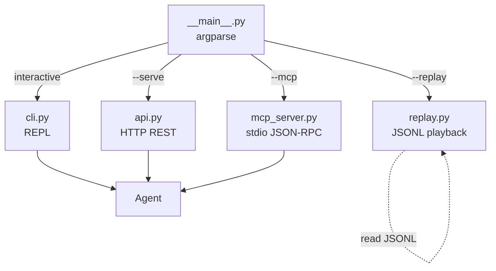
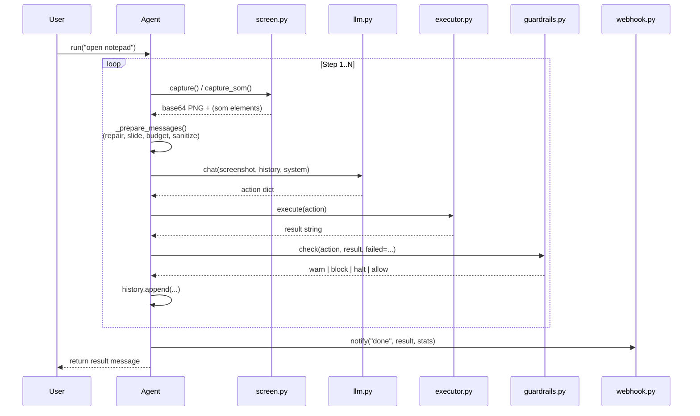

# Architecture

> Deep dive into the design and data flow of Computer Use Agent v0.2.0.

## High-level

Computer Use Agent (CUA) is a **perception → reasoning → action** loop driven by any
OpenAI-compatible LLM. The agent sees the desktop via screenshots, decides the next
action (click / type / key / etc.), executes it via the OS, and repeats until the task
is done.

```mermaid
flowchart LR
    User[User Task] --> Agent[Agent.run]
    Agent -->|1. Capture| Screen[screen.py<br/>mss / ImageGrab]
    Screen -->|2. PNG bytes| LLM[llm.py<br/>OpenAI client]
    LLM -->|3. JSON action| Sanitize[sanitization.py<br/>5-pass JSON repair]
    Sanitize -->|4. Clean action| Execute[executor.py<br/>pyautogui]
    Execute -->|5. Result| Guard[guardrails.py<br/>loop detection]
    Guard -->|continue| Agent
    Guard -->|halt / done| Webhook[webhook.py<br/>notify + payload]

    History[history: list[dict]] --> Agent
    LLM -->|tokens| Budget[token_budget.py<br/>3-layer cap]
    Budget --> History
```

## Core modules

| Module | Responsibility | Key APIs |
|---|---|---|
| `agent.py` | Main loop, orchestration, stats | `Agent.run(task)`, `Agent.interrupt()` |
| `llm.py` | OpenAI-compatible client, retry, JSON parsing | `chat(screenshot, history, ...)` |
| `executor.py` | 12 action types (click, type, key, ...) | `execute(action)` |
| `screen.py` | Screenshot (multi-monitor via mss) | `capture()`, `capture_som()`, `get_screen_info()` |
| `uia_tree.py` | Windows UIA element tree + SOM overlay | `get_elements()`, `render_som()` |
| `guardrails.py` | Tool-loop / no-progress detection | `ToolCallGuardrails.check()` |
| `sanitization.py` | 5-pass JSON repair + message sequence fix | `repair_json()`, `sanitize_api_messages()` |
| `token_budget.py` | 3-layer context overflow defense | `enforce_history_budget()`, `should_compress()` |
| `prompts.py` | 10-block system prompt builder | `build_system_prompt()`, `get_system_prompt()` |

## Reliability patterns (borrowed from Hermes Agent)

- **Activity heartbeat** (`Agent._touch_activity`) — `time.time()` updated on every step;
  stale loop detected and reflected back to LLM as a hint.
- **Threading.Event interrupt** (`Agent._interrupt_event`) — cross-platform (Windows +
  POSIX), settable from CLI / API / MCP. Checked at sub-step granularity.
- **Jittered exponential backoff** — `1.0 → 2.0 → 4.0s` with ±50% jitter to avoid
  rate-limit stampedes.
- **5-pass JSON repair cascade** — `json.loads(strict=False)` → trailing comma → bracket
  closure → excess closing → control-char escape.
- **3-layer token budget** — per-message cap (5K) → per-entry preview → total (200K).
- **Image sliding window** (UI-TARS) — keep last 5 images in uitars mode.
- **Guardrails** — 3 strategies: same-tool-failure accumulation, no-progress (identical
  screenshots), exact-fail loop signature.

## Modes

### Capture mode (`CAPTURE_MODE`)

| Mode | Mechanism | Best for |
|---|---|---|
| `som` (default) | UIA element tree + numbered red overlay, click by `element: N` | High-accuracy clicking |
| `vision` | Screenshot + cyan coordinate grid, click by `coordinate: [x, y]` | Maximum model compatibility |
| `uitars` | Pure screenshot, normalized 0–1000 coords, UI-TARS action names | UI-TARS / Qwen-style models |

### Action dispatch

```
LLM JSON                    → executor
  {action: "left_click",
   coordinate: [x, y]}        → pyautogui.click(x, y)
  {action: "left_click",
   element: 7}                → executor._resolve_click_target → coord from som_elements
  {action: "type", text: "x"}  → _clipboard_paste (CJK) | pyautogui.typewrite (ASCII ≤10)
  {action: "drag",
   from: [x1,y1], to: [x2,y2]} → pyautogui.moveTo/mouseDown/moveTo/mouseUp (10 steps)
  ...
```

## Entry points



| Entry | Command | Use case |
|---|---|---|
| REPL | `cua` or `python -m computer_use_agent` | Interactive exploration |
| Quick task | `cua "open notepad"` | One-off automation |
| HTTP API | `cua --serve --port 8080` | Other agents / dashboards |
| MCP Server | `cua --mcp` | Claude Desktop / Cursor / Zed |
| Replay | `cua --replay session.jsonl` | Audit / debugging / dataset |

## Data flow: a single step



## Threading model

| Thread | Started by | Purpose |
|---|---|---|
| Main | `__main__.py` | CLI / REPL / one-shot task |
| API worker | `api.py:_worker` | Pulls from `_task_queue`, runs `agent.run()` |
| MCP worker | `mcp_server.py:_worker` | Pulls from MCP `_task_queue`, runs `agent.run()` |
| Webhook async | `webhook.notify` (daemon) | POSTs to `WEBHOOK_URL` without blocking |
| Replay stdout | main | Prints actions |

`Agent` is **not thread-safe across processes**, but supports **one concurrent run per
process** (multiple workers would race on `_task_results` / `system_prompt` cache). For
multi-tenant setups, spawn one process per agent.

## Cross-cutting concerns

### Configuration (`config.py`)

- Loaded via `pydantic-settings` if available, else legacy `os.getenv`
- All settings also exposed as module-level constants (`config.LLM_API_KEY`, etc.)
- CLI args override `.env` values

### Logging (`logger.py`)

- Console: ANSI color (`_ColorFormatter`)
- File: `RotatingFileHandler(10MB × 5)` with secret redaction
- Format: `LOG_FORMAT=json|text` (default text)
- Redacts: OpenAI / Anthropic / GitHub / AWS / Bearer / password / private keys

### i18n (`i18n.py`)

- JSON-based, no `.mo` compilation
- Default `zh-CN`, `LANGUAGE=en-US` to switch
- 41 translation keys (slash commands + action descriptions)
- Custom translations via `i18n.load_custom_translations(file)`

### Plugins (`plugins.py`)

- Loaded from `~/.config/cua/plugins/*.py`, `CUA_PLUGINS_DIR`, or `~/.cua/plugins/`
- Each plugin exports `register(registry: ActionRegistry)`
- `ActionRegistry` supports `@registry.register()` decorator or `register_method()`
- Schema auto-inferred from function signature (`_infer_schema`)

## Security

| Concern | Mitigation |
|---|---|
| HTTP API exposed to network | Bind to `127.0.0.1` by default; require `API_TOKEN` for `0.0.0.0` |
| API auth bypass | `hmac.compare_digest` to prevent timing attacks |
| CORS wildcard | Echoes request `Origin`; only `*` when `API_TOKEN` is set |
| pyautogui runaway | `PYAUTOGUI_FAILSAFE=1` opt-in (mouse-to-corner kill switch) |
| Secret leakage in logs | 12 regex patterns redact `sk-*` / `ghp_*` / `Authorization: Bearer` / private keys |
| Untrusted action sequences | Guardrails: 3 strategies, 6-fail block / 10-fail halt |

## File sizes (v0.2.0)

```
computer_use_agent/
  __main__.py        4.7 KB
  agent.py          ~25 KB
  llm.py             11 KB
  executor.py        12 KB
  screen.py          4.5 KB
  uia_tree.py        5.5 KB
  api.py             13 KB
  cli.py            ~38 KB
  tui.py             4.0 KB
  i18n.py            6.5 KB
  plugins.py         5.0 KB
  mcp_server.py      9.0 KB
  replay.py          4.5 KB
  webhook.py         3.0 KB
  config.py          6.5 KB
  logger.py          5.0 KB
  prompts.py         13 KB
  sanitization.py    8.0 KB
  token_budget.py    5.0 KB
  guardrails.py      5.0 KB
  visual_effects.py  9.0 KB
  notify.py          1.5 KB
```

Total: ~200 KB Python source, zero external runtime deps beyond `requirements.txt`.
